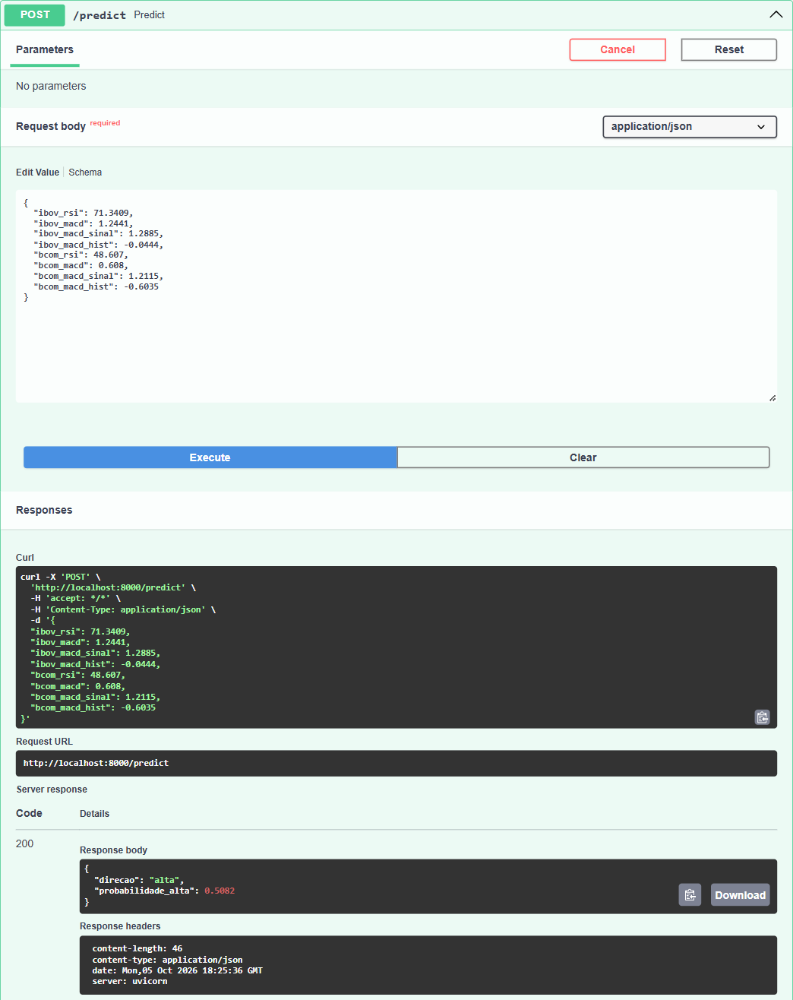
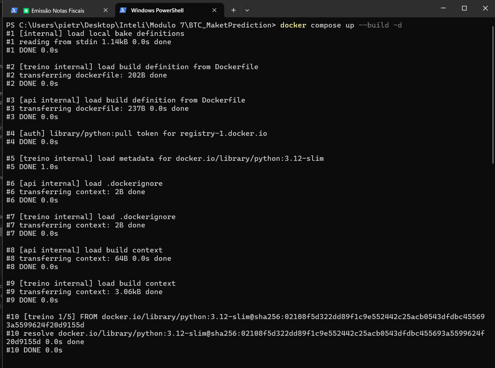
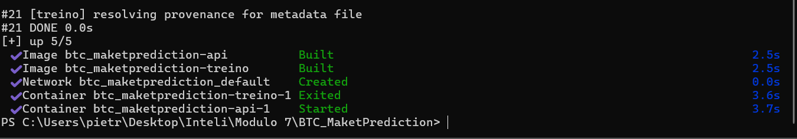
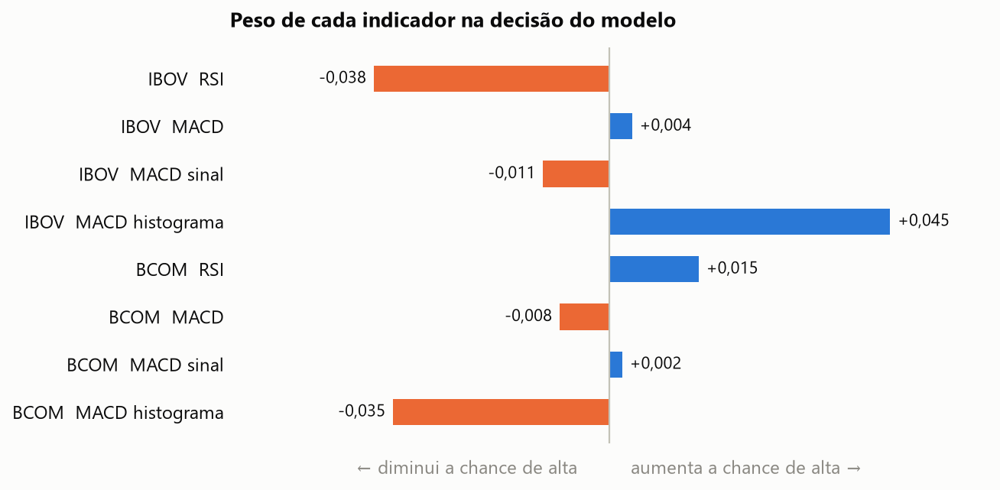
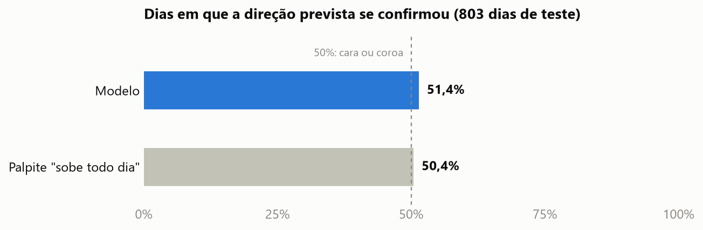

# Pietro Alkmin

## Tese

- Começando pela tese, quero "prever" o movimento do IBOV com base na análise de correlação com BCOM, isso vai ser metrificado principalmente por RSI, MACD, MACD signal e MACD Hist. A primeira coisa que vou fazer é definir a lógica, arquitetura, dependências, modelos e diagrama UML.

Defini que vou usar a biblioteca do Yahoo finance para comparar dois índices principais, IBOV e BCOM(Bloomberg Commodity Index) e por conta de tempo, defini que vou usar um modelo simples de tendência para calcular os indicadores.

## Arquitetura/lógica

Imagem do Excalidraw explicando a ideia, dependência, ferramentas e lógica:


**Por que regressão logística inicialmente:**

- Quero prever o movimento, e movimento é direção: sobe ou cai. Isso é classificação, então o modelo devolve a probabilidade de o IBOV fechar em alta no pregão seguinte.
- Fica simples de explicar: acerto no teste contra o palpite "sempre sobe", já que o IBOV sobe em 51,1% dos pregões desde 2010.
- 
**Algumas considerações dos dados(Obtidos através de análise com IA):**

- O BCOM não existe no Yahoo Finance: os códigos `^BCOM` e `^BCOMTR` voltam vazios. Por isso ele entra pelo DJP, fundo que replica o índice.
- Ficam os dias em que IBOV e DJP negociaram juntos, em um CSV dentro do repositório.
- Antes de treinar, a correlação medida entre os dois foi 0,34 no mesmo dia e praticamente zero (−0,001) de um dia para o outro. Então o acerto esperado fica perto de 51%, e isso já entra como limitação conhecida.

**Por que essa arquitetura:**

- Dois containers, como o enunciado pede: um treina e termina, o outro fica no ar servindo a predição.
- O modelo chega à inferência por um volume compartilhado, a pasta `modelo/`: o treino grava e a API lê ao subir. Preferi o volume a copiar o arquivo para dentro da imagem porque assim o caminho do artefato fica visível.
- O download dos dados fica fora do Docker e roda uma vez só.
- O backend é FastAPI com as duas rotas que o enunciado está pedindo: `GET /health` e `POST /predict`.

## Funcionamento esperado do sistema

Diagrama UML de componentes:


- Mostra quem são as peças e o que cada uma entrega para a outra: dados, treino, volume, inferência e cliente.
- Tras o que o enunciado pede: o modelo treinado chega ao container de inferência porque o treino grava no volume e a API lê de lá.
- Foi feito em Mermaid por ser mais rápido que desenhar, código gerado por IA.
- 
Diagrama UML de sequência:


- Primeiro o treino roda e grava o modelo, só depois a API sobe e lê o arquivo. Se a ordem inverter, a API sobe sem modelo.
- Com a API no ar, o client confere o `/health` e manda os 8 indicadores para o `/predict`, que devolve a direção e a probabilidade de alta.


# 2 - Implementação da Infra 

Parti para a criação do container de treinamento, baixei as dependencias e importei os indices que comentei lá em cima. Salvei em CSV esses dados para facilitar manipulação posterior. 

**Arquivos da primeira implementação:**

| Arquivo | O que faz |
|---|---|
| [`baixar_dados.py`](baixar_dados.py) | Baixa IBOV e DJP do Yahoo e grava `dados/indices.csv`. Roda fora do Docker. |
| [`treino/treinar.py`](treino/treinar.py) | Calcula os indicadores, treina, testa e grava o modelo. |
| [`api/main.py`](api/main.py) | Carrega o modelo e responde `/health` e `/predict`. |
| [`docker-compose.yml`](docker-compose.yml) | Sobe os dois containers e monta a pasta `modelo/` como volume. |

**Container de treino:**

```dockerfile
FROM python:3.12-slim
WORKDIR /app
COPY requirements.txt .
RUN pip install --no-cache-dir -r requirements.txt
COPY treinar.py .
CMD ["python", "treinar.py"]
```

- Imagem `slim` com só três bibliotecas: pandas, scikit-learn e joblib.
- O `requirements.txt` entra antes do código, então mudar o script não reinstala as bibliotecas.
- O container roda o treino e termina, não fica no ar.

O alvo e o corte entre treino e teste:

**Obs: Código gerado com IA!**
```python 
# alvo: fechamento do pregão seguinte acima do fechamento do dia
alta = (precos["ibov"].shift(-1) > precos["ibov"]).astype(int)

corte = int(len(x) * 0.8)  # corte cronológico, sem embaralhar
x_treino, x_teste, y_treino, y_teste = x[:corte], x[corte:], alta[:corte], alta[corte:]

modelo = make_pipeline(StandardScaler(), LogisticRegression()).fit(x_treino.to_numpy(), y_treino)
```

**Obs: Dados obtidos com código de IA!**
- Treino: 26/02/2010 a 14/06/2023, 3.210 pregões. Teste: 15/06/2023 a 01/10/2026, 803 pregões.
- Os 35 primeiros dias ficam de fora, para as médias do MACD estabilizarem.
- O `modelo.joblib` guarda o modelo e a ordem das 8 entradas juntos, para a API usar a mesma ordem do treino.

**Container de inferência:**

**Obs: Código gerado com IA!**

```python
artefato = joblib.load("/modelo/modelo.joblib")
modelo, entradas = artefato["modelo"], artefato["entradas"]


@app.get("/health")
def health():
    return {"status": "ok"}


@app.post("/predict")
def predict(indicadores: Indicadores):
    # a ordem das entradas vem do artefato, a mesma usada no treino
    linha = [[getattr(indicadores, nome) for nome in entradas]]
    probabilidade = float(modelo.predict_proba(linha)[0, 1])
    return {"direcao": "alta" if probabilidade >= 0.5 else "queda", "probabilidade_alta": round(probabilidade, 4)}
```

- O modelo é carregado uma vez, quando a API sobe.
- O `/predict` valida a entrada: faltando um dos 8 indicadores, devolve erro 422.
- O Dockerfile é o mesmo do treino, mudando o arquivo copiado e o comando final, que sobe o uvicorn na porta 8000.

**Docker Compose:**

```yaml
services:
  treino:
    build: ./treino
    volumes:
      - ./dados:/dados:ro
      - ./modelo:/modelo

  api:
    build: ./api
    ports:
      - "8000:8000"
    volumes:
      - ./modelo:/modelo:ro
    depends_on:
      treino:
        condition: service_completed_successfully
```

- Só o treino escreve em `modelo/`. A API e os dados entram como somente leitura
- O `depends_on` garante a ordem: a API só sobe depois que o treino termina sem erro.

**Primeira execução:**

**Obs: Scripts gerados com IA!**

```
$ docker compose up --build -d
$ docker compose ps -a
api      running   0.0.0.0:8000->8000/tcp
treino   exited    Exited (0)

$ curl http://localhost:8000/health
{"status":"ok"}

$ curl -X POST http://localhost:8000/predict -H "Content-Type: application/json" -d @modelo/exemplo.json
{"direcao":"alta","probabilidade_alta":0.5082}
```
# 3 - Backtest/Resultados primeira run

**A predição funcionando:**



- Print da página `/docs` da API. A requisição leva os 8 indicadores e a resposta volta com a direção e a probabilidade de alta

**Containers no ar:**



- O `docker compose up --build -d` começa construindo as duas imagens, a do treino e a da API.



- No fim do mesmo comando, o container de treino roda e termina (`Exited`) e só então o da API sobe (`Started`).

**O que o modelo aprendeu:**



- A regressão logística é explicável: cada uma das 8 entradas tem um peso. Barra azul aumenta a chance de "alta", barra laranja diminui.
- Os pesos são todos pequenos. O modelo quase não usa os indicadores e responde "alta" na maioria dos dias.

**Quanto ele acerta:**



- No período de teste, que o modelo nunca viu no treino, ele acertou a direção em 51,4% dos dias. Dizer "sobe" todo dia acertaria 50,4%.
- Os gráficos saem do `metricas.json` gravado pelo treino, com o script [`graficos.py`](graficos.py).
