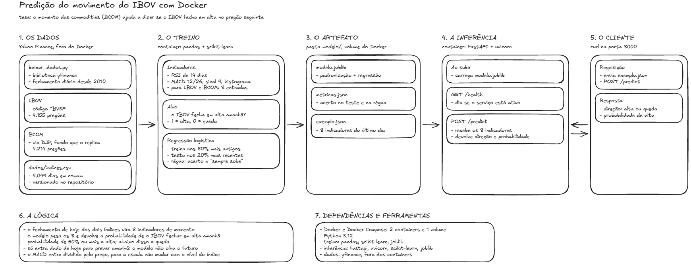
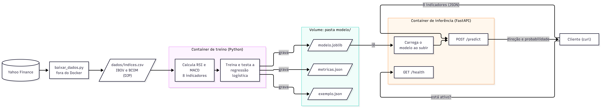
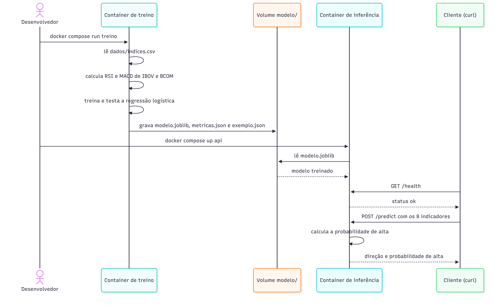

# Pietro Alkmin

## Tese

- Começando pela tese, quero "prever" o movimento do IBOV com base na análise de correlação com BCOM, isso vai ser metrificado principalmente por RSI, MACD, MACD signal e MACD Hist. A primeira coisa que vou fazer é definir a lógica, arquitetura, dependências, modelos e diagrama UML.

Defini que vou usar a biblioteca do Yahoo finance para comparar dois índices principais, IBOV e BCOM(Bloomberg Commodity Index) e por conta de tempo, defini que vou usar um modelo simples de tendência para calcular os indicadores.

## Arquitetura/lógica

Imagem do Excalidraw explicando a ideia, dependência, ferramentas e lógica:

**Por que regressão logística inicialmente:**

- Quero prever o movimento, e movimento é direção: sobe ou cai. Isso é classificação, então o modelo devolve a probabilidade de o IBOV fechar em alta no pregão seguinte.
- Fica simples de explicar: acerto no teste contra o palpite "sempre sobe", já que o IBOV sobe em 51,1% dos pregões desde 2010.
- 
**Passo a passo dos dados:**

- O BCOM não existe no Yahoo Finance: os códigos `^BCOM` e `^BCOMTR` voltam vazios. Por isso ele entra pelo DJP, fundo que replica o índice.
- Ficam os dias em que IBOV e DJP negociaram juntos, em um CSV dentro do repositório.
- Antes de treinar, a correlação medida entre os dois foi 0,34 no mesmo dia e praticamente zero (−0,001) de um dia para o outro. Então o acerto esperado fica perto de 51%, e isso já entra como limitação conhecida.

**Por que essa arquitetura:**

- Dois containers, como o enunciado pede: um treina e termina, o outro fica no ar servindo a predição.
- O modelo chega à inferência por um volume compartilhado, a pasta `modelo/`: o treino grava e a API lê ao subir. Preferi o volume a copiar o arquivo para dentro da imagem porque assim o caminho do artefato fica visível.
- O download dos dados fica fora do Docker e roda uma vez só.
- O backend é FastAPI com as duas rotas que o enunciado cobra: `GET /health` e `POST /predict`.

## Funcionamento esperado do sistema

Diagrama UML de componentes:

- Mostra quem são as peças e o que cada uma entrega para a outra: dados, treino, volume, inferência e cliente.
- Responde o que o enunciado cobra: o modelo treinado chega ao container de inferência porque o treino grava no volume e a API lê de lá.
- Foi feito em Mermaid por ser mais rápido que desenhar. O Mermaid não tem o diagrama de componentes da UML, então usei o fluxograma com subgrupos.

Diagrama UML de sequência:

- Mostra a ordem em que as coisas acontecem, que o diagrama de componentes não mostra.
- Primeiro o treino roda e grava o modelo; só depois a API sobe e lê o arquivo. Se a ordem inverter, a API sobe sem modelo.
- Com a API no ar, o cliente confere o `/health` e manda os 8 indicadores para o `/predict`, que devolve a direção e a probabilidade de alta.
